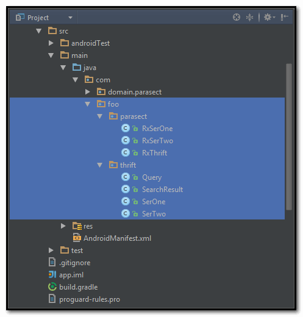

# Parasect : A lazy way to invoke method generated by thrift.exe#

### 0x00 example.thrift ##
```thrift
// Let's call this example.thrift

namespace java com.foo.thrift

service SerOne {
  /**
   * 用户登录， 返回登录信息 json 格式 [ 含登录结果， APP 的最新版本信息等 ]
   */
  string login (
    /** 用户名 */
    1: string nickname; 
    /** 用户密码 MD5 */
    2: string password;
  );
  
  /**
   * 用户退出
   */
  string logout (
    /** 会话信息 */
    1: string userSession;
  )
}

/**
 * 查询条件
 */
struct Query {
  /** 查询关键字 */
  1: required string text;
  /** 查询起点时间 */
  2: optional i64 resultsNewerThan;
}

/**
 * 查询结果
 */
struct SearchResult {
  /** url */
  1: required string url;
  /** A list of keywords related to the result */
  2: required list<string> keywords = [];
  /** The time at which the result was last checked, in unix millis */
  3: required i64 lastUpdatedMillis;
}

service SerTwo {
  /** 请求查询 */
  list<SearchResult> search(
    /** 查询条件 */
    1: Query query;
  );
}
```

### 0x01 Generate Java Code ###


```bash
::on  windowns:
thrift -gen java example.thrift
java -jar parasect.jar example.thrift
```

  

### 0x02 Add Dependency  ###

```groovy
buildscript {
    repositories {
        mavenCentral()
    }

    dependencies {
        classpath 'me.tatarka:gradle-retrolambda:3.2.5'
    }
}

//apply plugin: 'com.android.application'
apply plugin: 'me.tatarka.retrolambda'

android {
//    compileSdkVersion 23
//    buildToolsVersion "23.0.3"
//
//    defaultConfig {
//        applicationId 'com.example.thrifttail'
//        minSdkVersion 15
//        targetSdkVersion 23
//        versionCode 1
//        versionName "1.0"
//    }
//    buildTypes {
//        release {
//            minifyEnabled false
//            proguardFiles getDefaultProguardFile('proguard-android.txt'), 'proguard-rules.pro'
//        }
//    }
//
//    lintOptions {
//        abortOnError false
//    }
    compileOptions {
        sourceCompatibility JavaVersion.VERSION_1_8
        targetCompatibility JavaVersion.VERSION_1_8
    }
//    productFlavors {}
}

dependencies {
//    compile fileTree(include: ['*.jar'], dir: 'libs')
//    testCompile 'junit:junit:4.12'
//    compile 'com.android.support:appcompat-v7:23.3.0'
    compile 'io.reactivex:rxandroid:1.1.0'
    // Because RxAndroid releases are few and far between, it is recommended you also
    // explicitly depend on RxJava's latest version for bug fixes and new features.
    compile 'io.reactivex:rxjava:1.1.3'
}
```  

### 0x03  Usage ###

```java
/**
 * Description : login presenter
 *
 * @author Ban on 4/21/2016.
 */
public class LoginPresenter implements LoginP {

    private final static String TAG = LoginPresenter.class.getSimpleName();
    private LoginV loginV;

    public LoginPresenter(LoginV loginV) {
        this.loginV = loginV;
    }

    @Override
    public void login(String host, int port, String username, String password) {
        RxThrift.ber4SerOne = new RxThrift.Builder(host, port);
        // TODO: 4/22/2016 show loading
        RxSerOne.login(username, password)
                .map(str -> {
                    // work thread
                    Log.d(TAG, "MAIN THREAD ? " + String.valueOf(Looper.myLooper() == Looper.getMainLooper()));
                    // TODO: 4/21/2016 save user info to config file
                    // TODO: 4/21/2016 save result json info to config file
                    return str;
                })
                .observeOn(AndroidSchedulers.mainThread())
                .subscribe(str -> {
                    Log.d(TAG, str);
                    loginV.loginSuccess(str);
                }, throwable -> {
                    throwable.printStackTrace();
                    loginV.loginFailed(throwable.toString());
                });
    }
}
```
