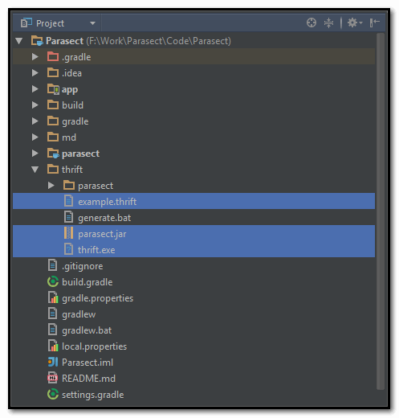

## Parasect : A lazy way to invoke method generated by thrift.exe ##

### 0x00 example.thrift ##
```thrift
// Let's call this example.thrift

namespace java com.foo.thrift

service SerOne {
  /**
   * 用户登录， 返回登录信息 json 格式 [ 含登录结果， APP 的最新版本信息等 ]
   */
  string login (
    /** 用户名 */
    1: string nickname; 
    /** 用户密码 MD5 */
    2: string password;
  );
  
  /**
   * 用户退出
   */
  string logout (
    /** 会话信息 */
    1: string userSession;
  )
}
```

### 0x01 Generate Java Code ###



```bash
::on  windowns:
thrift -gen java example.thrift
java -jar parasect.jar example.thrift
```

  

### 0x02 Add Dependency  ###

```groovy
buildscript {
    repositories {
        mavenCentral()
    }

    dependencies {
        classpath 'me.tatarka:gradle-retrolambda:3.2.5'
    }
}
apply plugin: 'me.tatarka.retrolambda'

android {
    compileOptions {
        sourceCompatibility JavaVersion.VERSION_1_8
        targetCompatibility JavaVersion.VERSION_1_8
    }
}

dependencies {
    compile 'io.reactivex:rxandroid:1.1.0'
    compile 'io.reactivex:rxjava:1.1.3'
}
```  

### 0x03  Usage ###

```java
@Override
public void login(String host, int port, String username, String password) {
    RxThrift.ber4SerOne = new RxThrift.Builder(host, port);
    // TODO: 4/22/2016 show loading
    RxSerOne.login(username, password)
            .map(str -> {
                // work thread
                Log.d(TAG, "MAIN THREAD ? " + String.valueOf(Looper.myLooper() == Looper.getMainLooper()));
                // TODO: 4/21/2016 save user info to config file
                // TODO: 4/21/2016 save result json info to config file
                return str;
            })
            .observeOn(AndroidSchedulers.mainThread())
            .subscribe(str -> {
                Log.d(TAG, str);
                loginV.loginSuccess(str);
            }, throwable -> {
                throwable.printStackTrace();
                loginV.loginFailed(throwable.toString());
            });
}
```
